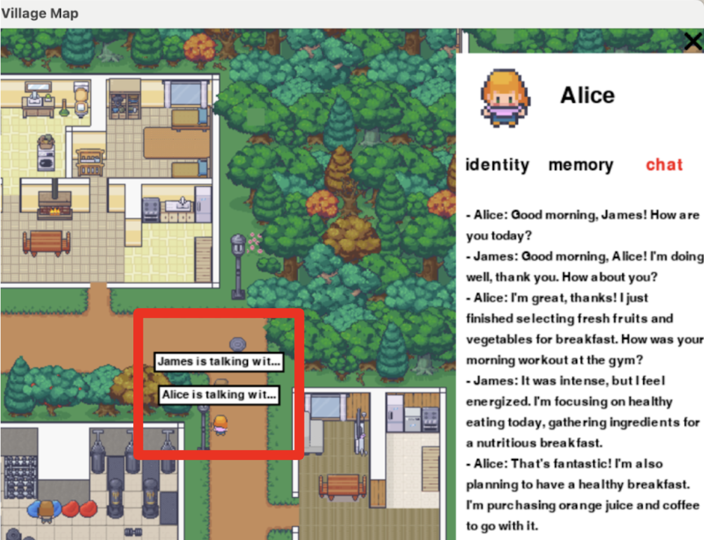
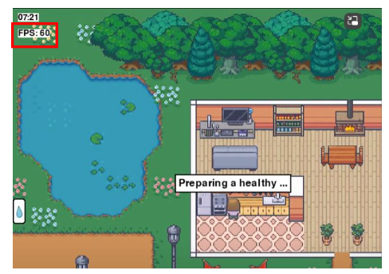

# AI-LLM-Driven NPC Generation: A Virtual Village Simulation

This project explores the intersection of AI, neuroscience, and game development by creating a virtual village with realistic non-player characters (NPCs). Leveraging advanced large language models (LLMs) like GPT-3.5-turbo, we generate NPCs that autonomously interact and simulate human-like behaviors. Techniques in prompt engineering fine-tune the interactions and decision-making processes of these agents.

Our architecture is divided into a back-end and a front-end. The back-end handles NPC behavior logic, including memory management, emotional responses, and interactions, inspired by neuroscience principles. The front-end, developed with Pygame and Tiled, visualizes the village and NPC interactions in real-time.


<p align="center">
  
  
</p>

## Installation

1. **Clone the repository:**

    ```sh
    git clone https://github.com/gitgab22/AI-LLM-Driven-NPC-Generation.git
    cd AI-Driven-NPC-Generation
    ```
    
2. **Activate the virtual environment:**

    ```sh
    source .venv/bin/activate  # On Windows, use `.venv\Scripts\activate`
    ```

3. **Install the required packages:**

    ```sh
    pip install -r requirements.txt
    ```
    
4. **Create a `.env` file in the `back_end` directory with your OpenAI API key:**

    ```sh
    echo "OPENAI_API_KEY=yourkey" > back_end/.env
    ```

## Usage

1. **Run the simulation:**

    ```sh
    python main.py
    ```

## Contributors

- Zakaria A.
- Yingwei T.
- Brahim T.
- Siyuan Z.
